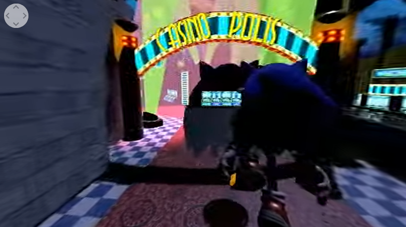

# Casinopolis (Sonic Adventure) 360° Stereoscopic Video

The repository for a 360° video meant to be seen with cardboard, available here : https://www.youtube.com/watch?v=1_RgGCW3HTI

Made for the VR course at Université de Montpellier, 2020. Credits are given in the Youtube video description.

Download the archive in the "game" folder, extract it, and run BumperEngine.exe to play the actual stage the video was made on. Though keep in mind it was meant to be recorded for a video, not actual gameplay, so you might find broken collisions or whatnot around.

Textures folder contain some texture showcase and scripts my own -messy- scripts (not from Bumper Engine's that is)

